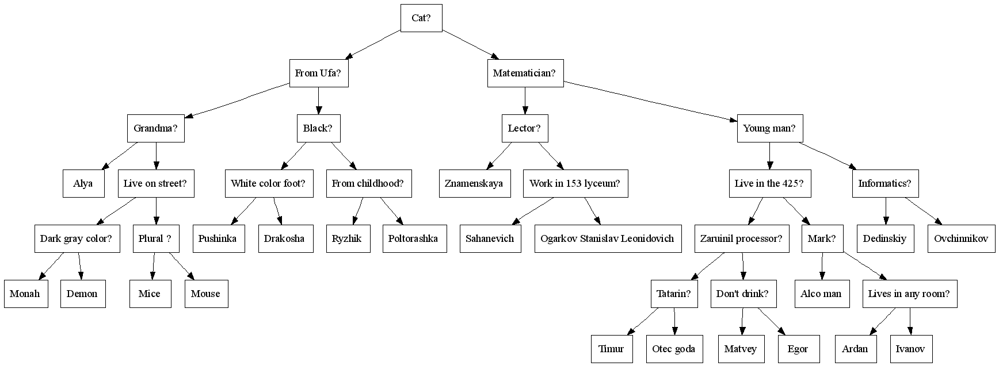

# Akinator

## Предпосылки

**«Акинатор»** — компьютерная интернет-игра, разработанная двумя французскими программистами в 2007 году. Игрок должен загадать любого персонажа, а Джинн Акинатор — главный персонаж игры — должен его отгадать.

## Реализация

Акинатор в нашей реализации будет представлять собой двоичное дерево, в узлах которой будут вопросы, а на листах варианты ответа (имена персонажей). Наше дерево будет строиться из [файла](https://github.com/Exactlywb/Akinator/blob/main/data/baseOld.txt), называемого базой данных. 

    

Времена идут, а Акинатор сам по себе умнее не становится, так что рано или поздно он не отгадает задуманного персонажа. В таком случае, он любезно спросит пользователя имя нового персонажа и обновит базу данных. 

*Более того, вся игра сопровождается озвучкой. Спасибо [https://github.com/ded32/TXLib](TXLib)*
